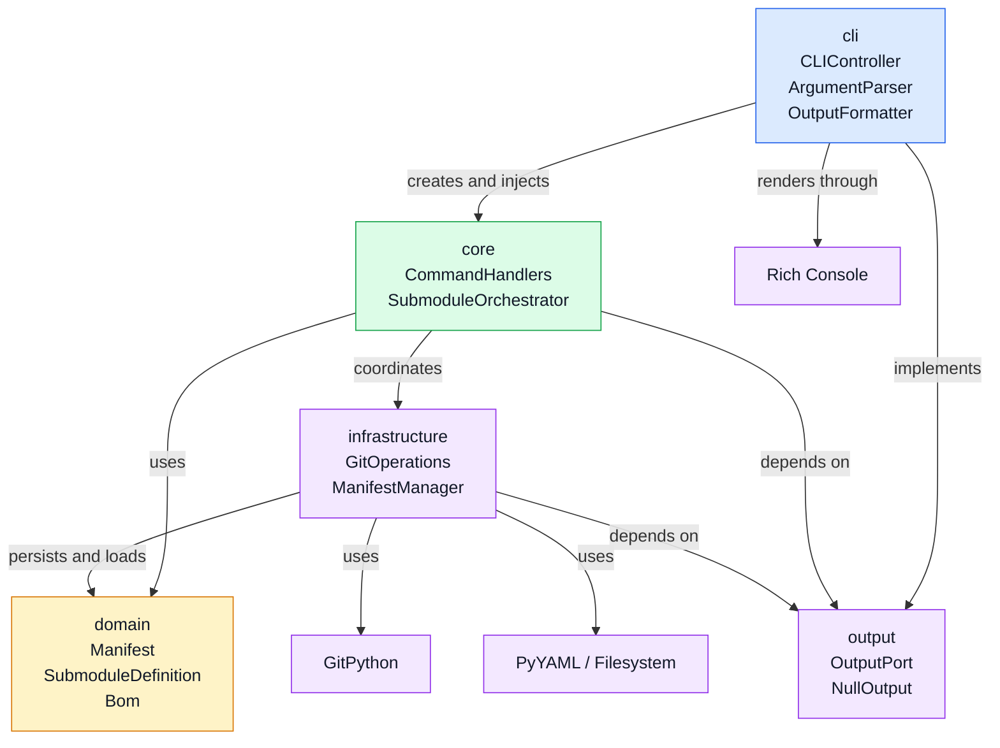
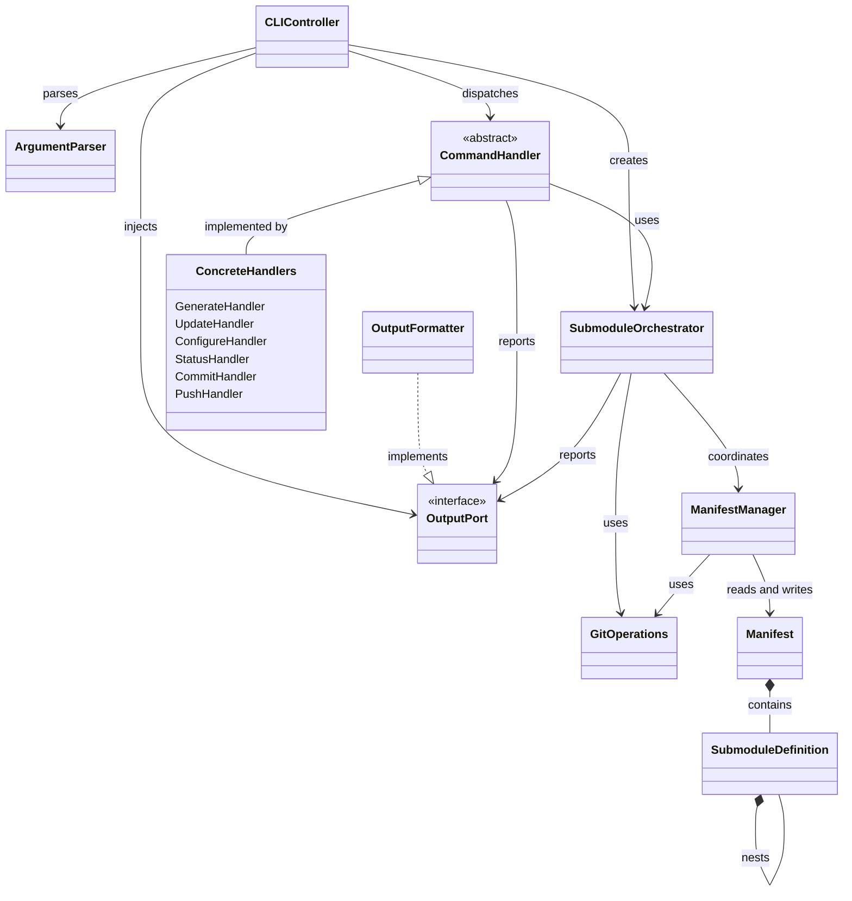

# YAGSO Architecture Proposal

## Overview

YAGSO (Yet Another Git Submodule Orchestrator) is a CLI tool for managing Git submodules using a manifest-based approach. This document proposes a layered architecture designed for scalability, maintainability, and clear separation of concerns.

## Architectural Principles

- **Layered Architecture**: Clear separation between CLI interface, business logic, data management, and infrastructure
- **Single Responsibility**: Each class has one clear responsibility
- **Dependency Inversion**: Higher layers depend on abstractions, not concretions
- **Testability**: Architecture supports comprehensive unit testing
- **Extensibility**: Easy to add new commands and features

## Layered Architecture

### 1. Presentation Layer (CLI Interface)

**Purpose**: Command-line interface parsing, validation, and user interaction.

**Components**:

#### `CLIController`
- **Responsibility**: Main entry point, command routing, argument parsing
- **Dependencies**: Command handlers, output formatter
- **Methods**:
  - `run(args)`: Parse arguments and dispatch to appropriate command
  - `handle_generate(options)`
  - `handle_update(options)`
  - `handle_configure(options)`
  - `handle_commit(options)`
  - `handle_push(options)`

#### `ArgumentParser`
- **Responsibility**: Parse and validate command-line arguments using argparse
- **Dependencies**: argparse
- **Methods**:
  - `parse(args)`: Parse raw arguments into structured options
  - `validate(options)`: Validate argument combinations

#### `OutputFormatter`
- **Responsibility**: Format and display results to user
- **Dependencies**: `rich.console.Console`
- **Methods**:
  - `success(message)`
  - `error(message)`
  - `info(message)`
  - `progress(current, total, message)`

The CLI owns the Rich-backed `OutputFormatter` and exposes it through the public
`get_output_formatter()` accessor. It injects that instance into command handlers,
the orchestrator, and infrastructure services at the composition root.

Application and infrastructure layers depend on the presentation-neutral
`OutputPort` protocol in `yagso.output`, not on Rich or the CLI package. Library
callers may omit an output port and receive the no-op `NullOutput` implementation.

### 2. Application Layer (Business Logic)

**Purpose**: Core business operations, orchestration of domain objects.

**Components**:

#### `SubmoduleOrchestrator`
- **Responsibility**: High-level coordination of submodule operations
- **Dependencies**: ManifestManager, GitOperations, OutputPort
- **Methods**:
  - `generate_manifest(root_path)`: Generate yagso.yaml from repository structure
  - `update_submodules(options)`: Update/initialize submodules based on manifest
  - `configure_repository()`: Apply manifest configuration
  - `commit_changes(message)`: Commit all changes recursively
  - `push_changes()`: Push all commits to remote

#### `CommandHandlers`
- **Responsibility**: Handle specific commands with business logic
- **Dependencies**: SubmoduleOrchestrator, validators
- **Classes**:
  - `GenerateHandler`
  - `UpdateHandler`
  - `ConfigureHandler`
  - `CommitHandler`
  - `PushHandler`

### 3. Domain Layer (Core Business Objects)

**Purpose**: Domain entities and business rules.

**Components**:

#### `Manifest`
- **Responsibility**: Represent the yagso.yaml manifest structure
- **Dependencies**: None
- **Properties**:
  - `submodules`: List of SubmoduleDefinition
  - `version`: Manifest version
- **Methods**:
  - `validate()`: Ensure manifest integrity

#### `SubmoduleDefinition`
- **Responsibility**: Represent a single submodule configuration
- **Properties**:
  - `name`: Submodule name
  - `path`: Relative path
  - `url`: Git repository URL
  - `branch`: Target branch
  - `commit`: Specific commit hash (optional)

#### `RepositoryState`
- **Responsibility**: Represent current repository state
- **Properties**:
  - `root_path`: Repository root
  - `submodules`: Current submodule status
  - `is_initialized`: Whether submodules are cloned

### 4. Infrastructure Layer (External Interfaces)

**Purpose**: Abstract external dependencies (Git, filesystem, etc.).

**Components**:

#### `GitOperations`
- **Responsibility**: Interface to Git commands using gitpython
- **Dependencies**: gitpython
- **Methods**:
  - `get_submodules()`: List all submodules
  - `clone_submodule(url, path, branch)`
  - `update_submodule(path, options)`
  - `commit_all(message)`
  - `push_all()`
  - `get_status()`: Get repository status

#### `ManifestManager`
- **Responsibility**: Read/write manifest files using Python's native file operations
- **Dependencies**: pathlib, yaml, OutputPort
- **Methods**:
  - `load_manifest(path)`: Load yagso.yaml
  - `save_manifest(manifest, path)`: Save manifest
  - `generate_from_repository(root_path)`: Create manifest from .gitmodules
  - `save_bom(manifest, path, repo_root)`: Create a Bill Of Materials `BOM.yaml` that mirrors the
    manifest structure but keeps only `path`, the recorded `commit`, a single preferred `ref` (first
    entry in refs list) and a `files` list containing repository files for each submodule.

## Package Dependency Diagram

The CLI is the composition root. It creates the presentation adapter and injects
the `OutputPort` into the application and infrastructure layers. The domain layer
remains independent of all other YAGSO packages.



The important dependency rule is that `core` and `infrastructure` depend on the
neutral `OutputPort` abstraction, never on `cli` or Rich directly.

## Class Relationship Diagram

This diagram shows the main runtime relationships and the direction of injected
dependencies.



## Error Handling

- **Validation Errors**: Invalid arguments, missing files → CLIController handles with OutputFormatter
- **Git Errors**: Command failures → GitOperations raises GitError, caught by handlers
- **Manifest Errors**: Invalid YAML, missing fields → ManifestManager raises ManifestError
- **IO Errors**: File access issues → Handled by Python's built-in exceptions

## Testing Strategy

- **Unit Tests**: Test each class in isolation with mocks
- **Integration Tests**: Test layer interactions
- **End-to-End Tests**: Test complete command flows
- **Mock Infrastructure**: Use dependency injection for testability

## Extensibility

- **New Commands**: Add new handler class and register in CLIController
- **New Manifest Features**: Extend Manifest and SubmoduleDefinition classes
- **Alternative Git Backends**: Implement different GitOperations interface
- **Output Formats**: Extend OutputFormatter with new formatters

## Dependencies

- **Core Python**: argparse, pathlib, yaml
- **External**: gitpython (for Git operations)

## Directory Structure

```
yagso/
├── cli/
│   ├── __init__.py
│   ├── __main__.py  
│   ├── controller.py
│   ├── parser.py
│   └── formatter.py
├── core/
│   ├── __init__.py
│   ├── orchestrator.py
│   └── handlers.py
├── domain/
│   ├── __init__.py
│   ├── manifest.py
│   ├── submodule.py
│   └── repository.py
├── infrastructure/
│   ├── __init__.py
│   ├── git_ops.py
│   └── manifest_manager.py
└── __init__.py
```

This architecture provides a solid foundation for building a scalable, maintainable CLI tool with clear separation of concerns and room for future enhancements.